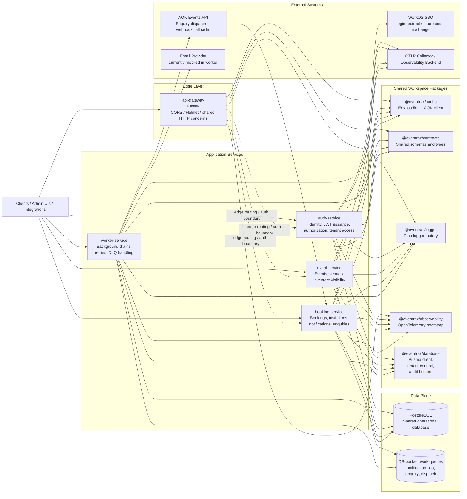

# System Architecture

This diagram reflects the current runtime shape of the repository as implemented today.

## Overview

## What The Diagram Shows

- `api-gateway` is the edge-facing Fastify service for shared HTTP concerns. It is present as the intended entry point, although upstream proxying to the other services is not implemented yet.
- `auth-service` owns authentication and authorization concerns, including JWT issuance/verification, permission resolution, and SSO entry points.
- `event-service` owns event-domain reads today and is positioned to hold event lifecycle, venue, and inventory capabilities.
- `booking-service` owns booking-adjacent synchronous APIs, including invitations, notifications, and enquiry orchestration.
- `worker-service` owns asynchronous processing. Today it drains database-backed notification and enquiry jobs, applies retries, and manages dead-letter behavior.
- All deployable services share the same PostgreSQL database through `@eventrax/database` and Prisma.
- Queueing is currently implemented inside PostgreSQL tables rather than a separate broker. The main queues visible in code are `notificationJob` and `enquiryDispatch`.
- Observability is bootstrapped per service through `@eventrax/observability` and exports to an OTLP-compatible backend when enabled.

## Domain Ownership By Data Area

- Identity and access: `Tenant`, `AppUser`, `UserDelegation`, `Entitlement`, `EntitlementLedger`
- Events and inventory: `Event`, `Venue`, `EventCategory`, `InventoryItem`, `InventorySnapshot`, `EventVisibility`
- Bookings and approvals: `Booking`, `ApprovalRule`, `ApprovalRequest`
- Guests and invitations: `Guest`, `Invitation`, `InvitationAudit`
- Messaging and async work: `Notification`, `NotificationJob`
- CRM-style enquiries: `Enquiry`, `EnquiryDispatch`, `EnquiryProposal`

## Current-State Notes

- Service boundaries are clear in code, but persistence is still centralized in one shared database.
- `auth-service` exposes a WorkOS login URL, while the full WorkOS code-exchange path is still a placeholder.
- `worker-service` currently uses a mock email provider abstraction; the integration boundary is present even though a production provider is not wired in yet.
- `booking-service` receives AOK webhook callbacks, while `worker-service` performs outbound AOK enquiry dispatch.
